# Soumyadeep Chakravarti

  

  <strong>BTech student · systems · AI · software</strong>

  <code>rust</code> <code>c</code> <code>python</code> <code>typescript</code>
  <code>linux</code> <code>docker</code> <code>pytorch</code> <code>react</code>

  <a href="https://github.com/Soumyadeep-Chakravarti">github</a> ·
  <a href="https://www.linkedin.com/in/soumyadeep-chakravarti-03237028a/">linkedin</a> ·
  <a href="mailto:soumyadeepsai1@gmail.com">email</a>

I like building things from the bottom up — understanding how they work,
then turning that understanding into software.

I'm currently studying Computer Science at **VIT Bhopal University**.

My interests sit somewhere between **systems programming, Linux, AI/ML,
developer tooling, and experimental software**. I tend to prefer small,
focused tools, local-first workflows, and software that gives me a reason
to understand the machinery underneath it.

Currently exploring Rust, C, Python, Linux internals, local AI, and the
general problem of making computers feel a little more programmable.

`rust` `c` `python` `typescript` `javascript`
`linux` `docker` `git` `pytorch` `react` `fastapi` `mongodb` `qdrant`

I work mostly on Linux and prefer tools that can run locally.

I care more about understanding a system than collecting abstractions
around it.

**[ENKI](https://github.com/Soumyadeep-Chakravarti/ENKI)** · `rust` `linux`

A Linux-native gesture input system. ENKI turns camera-based hand tracking
into an input layer, with gesture interpretation and event injection
designed to eventually replace conventional mouse and keyboard interaction.

**[BML](https://github.com/Soumyadeep-Chakravarti/bml)** · `c`

A mathematics library written from scratch in C. It is an experimental
foundation for vectors, matrices, geometry, expressions, and numerical
operations — primarily built to understand the machinery rather than
wrap an existing library.

  

  

  

  

This profile is intentionally built without external stat-image services.

The graphics are generated locally as SVGs. `ascii.svg` is produced from
a portrait using `scripts/make_portrait.py`, while the contribution,
streak, language, and year graphics are generated from the GitHub GraphQL
API by `scripts/generate_stats.py`.

A GitHub Actions workflow refreshes the statistics once a day and commits
only when something actually changes.

The graphics use embedded subsets of **JetBrains Mono** so their geometry
doesn't depend on whatever font happens to be installed on the viewer's
machine.

The result is a profile that is mostly just a Git repository: no external
stat-image service, no client-side JavaScript, and no dependency on a
third-party endpoint remaining online.
